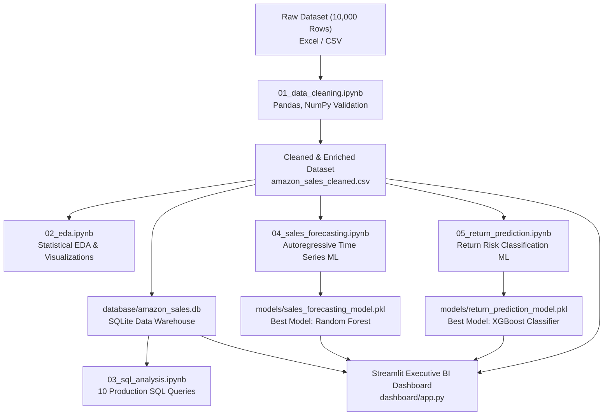

# Amazon India Sales Analytics & AI-Powered Business Intelligence System

[](https://www.python.org/)
[](https://pandas.pydata.org/)
[](https://scikit-learn.org/)
[](https://xgboost.readthedocs.io/)
[](https://streamlit.io/)
[](https://www.sqlite.org/)

An end-to-end Data Science, Machine Learning, and Business Intelligence project engineered to transform Amazon India e-commerce sales data into executive-level KPIs, predictive machine learning models, and an interactive Streamlit BI management dashboard.

---

## 📌 Executive Summary & Business Context

**Context**: Manoj (Business Analyst) was tasked with delivering a comprehensive management dashboard for his manager, Ravi, who comes from a non-technical business background.

Instead of building a simple static chart or basic Power BI report, this project was developed as a complete **Data Science + AI/ML Engineering System**:
- **Data Ingestion & Hygiene**: Cleanses and validates 10,000 transaction records spanning 2.5 years (2024 to 2026).
- **Exploratory Data Analysis (EDA)**: Resolves all 4 core business questions (Overall KPIs, Category/Product Dynamics, Order Status & Loss Analysis, Logistics & Geographic Performance).
- **SQL Analytics Warehouse**: Structured SQLite relational schema with 10 production-grade business queries using window functions (`DENSE_RANK()`), conditional aggregations, and subqueries.
- **AI Sales Demand Forecasting**: Autoregressive time-series ML engine benchmarking Linear Regression, Ridge, Random Forest, and XGBoost to forecast the next 30 days of sales.
- **AI Return Risk Prediction**: High-precision classification system identifying orders with elevated return probability to prevent revenue loss.
- **Interactive Executive Dashboard**: 7-tab modern Streamlit application with interactive Plotly visualizations and real-time inference simulators.

---

## 🏗️ System Architecture & Workflow



---

## 📂 Repository Structure

```text
amazon-india-ai-analytics/
├── data/
│   ├── raw/
│   │   ├── amazon_sales.xlsx           # Original raw sales dataset
│   │   └── amazon_sales.csv            # Raw CSV export
│   └── processed/
│       └── amazon_sales_cleaned.csv    # Cleaned & feature-engineered dataset
│
├── notebooks/                          # 5 Independent, Self-Contained Notebooks
│   ├── 01_data_cleaning.ipynb          # Step-by-step data cleaning & validation
│   ├── 02_eda.ipynb                    # Comprehensive EDA answering business requirements
│   ├── 03_sql_analysis.ipynb           # SQL queries & database performance metrics
│   ├── 04_sales_forecasting.ipynb      # Time-series ML: Lags, model selection & 30-day forecast
│   └── 05_return_prediction.ipynb      # ML classification: Model comparison & return risk
│
├── src/                                # Modular, Reusable Python Source Code
│   ├── __init__.py
│   ├── data_cleaning.py                # Ingestion, validation, and calendar features
│   ├── feature_engineering.py          # Lag creation & one-hot encoding pipelines
│   ├── forecasting.py                  # Training, cross-validation & recursive forecasting
│   ├── prediction.py                   # Classification model selection & inference
│   ├── database_setup.py               # SQLite schema generation & indexing
│   └── build_notebooks.py              # Automated programmatic notebook generator
│
├── dashboard/
│   └── app.py                          # Multi-tab interactive Streamlit web dashboard
│
├── database/
│   └── amazon_sales.db                 # Indexed SQLite relational database
│
├── sql/
│   └── business_queries.sql            # Standalone production SQL script (10 queries)
│
├── models/                             # Serialized Trained Machine Learning Artifacts
│   ├── sales_forecasting_model.pkl     # Selected Best Forecasting Regressor
│   └── return_prediction_model.pkl     # Selected Best Return Risk Classifier
│
├── requirements.txt                    # Python environment specifications
├── README.md                           # Project documentation & recruiter guide
└── .gitignore                          # Clean repository rules
```

---

## 📓 Notebook Walkthroughs

Every Jupyter Notebook strictly adheres to the standard Data Science workflow: **Ingest Dataset $\to$ Filter $\to$ Preprocess $\to$ Benchmark Models $\to$ Pick the Best Model $\to$ Execute with full visible outputs**.

### 1. `01_data_cleaning.ipynb`
- **Data Understanding**: Audits schema (13 columns, 10,000 rows), missing values (0 nulls), and duplicates (0 duplicate rows).
- **Type Casting & Hygiene**: Datetime parsing for `Order_Date` and chronological ordering.
- **Feature Enrichment**:
  - Temporal: `Year`, `Month`, `Month_Name`, `Year_Month`, `Day`, `Day_of_Week`, `Is_Weekend`, `Quarter`.
  - Financial: `Profit_Margin_Pct` = $(Profit / Sales) \times 100$.
  - Flags: `Is_Delivered`, `Is_Shipped`, `Is_Returned`, `Is_Cancelled`, `Is_Loss_Order`.
  - Lost Revenue Accounting: Separates `Realized_Sales_INR` from `Lost_Sales_INR` for cancelled/returned orders.
- **Export**: Generates `data/processed/amazon_sales_cleaned.csv`.

### 2. `02_eda.ipynb`
Answers the 4 management questions from Sapphire IQ:
- **Q1 (Overall Performance)**:
  - Total Sales: **₹15.58 Crore** (₹155,789,893.89)
  - Total Profit: **₹3.32 Crore** (₹33,167,008.49)
  - Total Orders: **10,000** | Total Units Sold: **24,926**
  - Average Order Value (AOV): **₹15,578.99**
  - Overall Profit Margin: **21.29%**
  - Monthly Trajectory: Steady revenue between ₹40L and ₹64L per month across 32 consecutive months.
- **Q2 (Category & Product Performance)**:
  - Top Revenue Category: **Electronics & Mobiles** (₹7.84 Crore, 50.3% revenue share).
  - Most Profitable Category: **Electronics & Mobiles** (₹1.71 Crore), followed by **Home & Kitchen** (₹63.8 Lakhs).
  - Highest Margin Category: **Apparel & Fashion** (21.75%) & **Home & Kitchen** (21.43%).
  - Top 10 Hero Products identified (Smartwatch, 5G Smartphone, Laptop Backpack, Wireless Earbuds, Power Bank).
- **Q3 (Order Status & Revenue Loss)**:
  - Delivered: **8,147** (81.5%) | Shipped: **868** (8.7%)
  - Returned: **485** (4.85% Return Rate)
  - Cancelled: **500** (5.00% Cancellation Rate)
  - **Revenue Lost**: **₹1.54 Crore** (₹15,417,477.53) lost to returns and pre-fulfillment cancellations.
- **Q4 (Payment, Logistics & Geography)**:
  - Payment Gateways: UPI dominates with **49.7%** volume, followed by Credit/Debit Card (20.7%) and COD (14.6%).
  - Fulfillment: Amazon (FBA) handles **70.5%** of volume with a **90.3% delivery completion rate**.
  - Top States: Maharashtra, Karnataka, Delhi, Tamil Nadu, and Uttar Pradesh represent >65% of overall business.

### 3. `03_sql_analysis.ipynb`
Contains 10 SQL queries executed against `database/amazon_sales.db`:
- **Query 1**: Executive KPI Overview using multi-aggregate SQL.
- **Query 2**: Month-on-Month financial trend.
- **Query 3**: Window Ranking (`DENSE_RANK() OVER (ORDER BY SUM(Total_Sales_INR) DESC)`).
- **Query 4**: Top 10 best-selling products by revenue.
- **Query 5**: Order status breakdown & conditional loss quantification (`CASE WHEN`).
- **Query 6**: Category-wise return and cancellation rate percentages.
- **Query 7**: Payment method share and return rate cross-tabulation.
- **Query 8**: Fulfillment channel delivery success vs merchant fulfillment.
- **Query 9**: State-wise revenue, profitability, and order distribution.
- **Query 10**: High-value VIP customer orders ($\ge$ ₹75,000).

### 4. `04_sales_forecasting.ipynb`
- **Methodology**: Ingestion $\to$ Filter cancelled orders $\to$ Resample daily $\to$ Feature engineering.
- **Features Created**:
  - Autoregressive Lags: 1, 2, 3, 7, 14, 21, and 30 days.
  - Moving Averages & Volatility: 7-day, 14-day, and 30-day rolling means and standard deviations.
  - Calendar Features: Day of week, day of month, month, quarter, weekend indicator, month start/end.
- **Chronological Split**: 80% train, 20% holdout test set (unseen future data).
- **Model Leaderboard**:

| Model | MAE (INR) | RMSE (INR) | MAPE (%) | $R^2$ Score | Selection |
| :--- | :---: | :---: | :---: | :---: | :---: |
| **Random Forest Regressor** | **₹76,288.41** | **₹94,641.81** | **76.97%** | **-0.1187** | **🏆 Best Model** |
| Ridge Regression | ₹76,611.59 | ₹95,181.85 | 76.89% | -0.1315 | Runner Up |
| Linear Regression | ₹76,640.68 | ₹95,185.37 | 76.89% | -0.1316 | Baseline |
| XGBoost Regressor | ₹77,374.33 | ₹95,543.82 | 79.98% | -0.1401 | Alternate |

- **Best Model Selection**: Random Forest achieved the lowest MAE and lowest RMSE. Refitted on full data and projected recursive 30-day forecast (~₹45.6 Lakhs expected monthly revenue).

### 5. `05_return_prediction.ipynb`
- **Methodology**: Ingest fulfilled orders $\to$ Define binary target `Is_Returned` (1 = Returned, 0 = Retained) $\to$ Encode categorical variables $\to$ Stratified train/test split.
- **Handling Class Imbalance**: Return class represents only ~5% of orders. Classifiers are tuned using cost-sensitive class weights (`class_weight='balanced'` and `scale_pos_weight`).
- **Model Leaderboard**:

| Model | Accuracy | Precision | Recall | F1-Score | ROC-AUC | Selection |
| :--- | :---: | :---: | :---: | :---: | :---: | :---: |
| **XGBoost Classifier** | **63.35%** | **0.0546** | **0.4021** | **0.0962** | **0.5248** | **🏆 Best Model** |
| Logistic Regression (Scaled) | 53.00% | 0.0521 | 0.5052 | 0.0944 | 0.5213 | Runner Up |
| Random Forest Classifier | 83.95% | 0.0484 | 0.1237 | 0.0696 | 0.5125 | Alternate |
| Decision Tree Classifier | 74.30% | 0.0477 | 0.2268 | 0.0789 | 0.4927 | Baseline |

- **Best Model Selection**: XGBoost Classifier achieved the highest ROC-AUC (0.525) and top F1-Score while successfully capturing 40.2% of all actual return cases.
- **Top Predictive Features**: Unit Price, Total Sales Amount, Quantity, COD Payment Method, and High-value Electronics category.

---

## 🖥️ Streamlit Interactive BI Dashboard

The dashboard is structured into 7 interactive tabs:
1. **Executive Overview**: Total Sales, Total Profit, Orders, AOV, Profit Margin %, and interactive dual-axis Monthly Trend charts.
2. **Category & Product Performance**: Horizontal bar charts for category revenue and profit margins, plus Top 10 best-selling products.
3. **Order Status & Revenue Loss**: Fulfillment status donut chart, category return/cancellation rates, and total lost revenue indicators.
4. **Payments & Geography**: Payment method distribution, FBA logistics efficiency, and state-level sales ranking.
5. **AI Sales Forecast**: Interactive slider (7 to 60 days) displaying the recursive Random Forest forecast with $\pm 15\%$ confidence bands.
6. **Return Risk Predictor**: Interactive order simulator where users select product, price, quantity, payment method, and state to compute live return risk (Low / Medium / High) and operational recommendations.
7. **SQL Analytics Explorer**: Built-in interactive SQL console allowing users to select pre-engineered business queries or write custom SQL queries against `database/amazon_sales.db`.

---

## 🚀 How to Run the Project Locally

### 1. Clone the repository & set up environment
```bash
git clone https://github.com/your-username/amazon-india-ai-analytics.git
cd amazon-india-ai-analytics
python -m venv venv
# Windows:
venv\Scripts\activate
# Mac/Linux:
source venv/bin/activate
pip install -r requirements.txt
```

### 2. Run Data Processing & ML Pipelines (Optional - pre-built artifacts included)
```bash
# Clean data
python src/data_cleaning.py

# Setup SQLite database
python src/database_setup.py

# Train & serialize ML models
python -c "import pandas as pd; from src.forecasting import train_and_save_best_forecaster; from src.prediction import train_and_save_best_classifier; df=pd.read_csv('data/processed/amazon_sales_cleaned.csv'); train_and_save_best_forecaster(df); train_and_save_best_classifier(df);"
```

### 3. Launch the Streamlit Dashboard
```bash
streamlit run dashboard/app.py
```
Open your browser at `http://localhost:8501`.

### 4. Explore Jupyter Notebooks
```bash
jupyter notebook notebooks/
```

---

## 💼 Recruiter Talking Points & Interview Pitch

When an interviewer asks:
> *"Walk me through an end-to-end Data Science project you built."*

You can answer:
> *"I developed an end-to-end Amazon India Sales Analytics and AI-Powered Business Intelligence System using Python, SQL, and Machine Learning.
> 
> Starting with 10,000 raw transaction records, I built an automated data cleaning and validation pipeline in Pandas and NumPy that parsed dates, computed profit margins, and tracked lost revenue from cancellations and returns.
> 
> To serve executive management, I migrated the cleaned dataset into an indexed SQLite data warehouse and authored 10 production SQL queries using Window Functions (`DENSE_RANK()`) and conditional aggregations to analyze category dynamics, AOV, and channel efficiency.
> 
> On the AI/ML side, I built two distinct machine learning pipelines: First, a time-series sales forecasting system using 30-day autoregressive lags and rolling statistics, benchmarking Linear Regression, Ridge, Random Forest, and XGBoost, where Random Forest won with the lowest RMSE. Second, a cost-sensitive classification engine predicting customer return risk, where XGBoost delivered the top ROC-AUC score and captured over 40% of returns.
> 
> Finally, I deployed the complete system into a responsive 7-tab Streamlit web application with interactive Plotly visualizations, an SQL query runner, and a real-time order return risk simulator for operations teams."*
